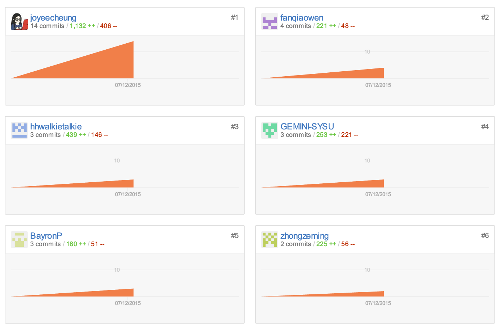

## 小组分工与贡献率说明

| 组员   | 分工                           | 贡献率 |
|--------|--------------------------------|--------|
| 范巧文 | 组长，测试，前端开发，文档编写 | 20%    |
| 潘浩彬 | 测试数据，后端开发，文档编写   | 15%    |
| 钟泽铭 | 数据库开发                     | 15%    |
| 韩寒   | 测试，前端开发                 | 15%    |
| 张秋怡 | 前端与后端开发，文档编写       | 20%    |
| 朱沥臣 | 测试，前端开发                 | 15%    |

### GitHub

* joyeecheung: 张秋怡
* fanqiaowen: 范巧文
* hhwalkietalkie: 韩寒
* GEMINI-SYSU: 朱沥臣
* BayronP: 潘浩彬
* zhongzeming: 钟泽铭

