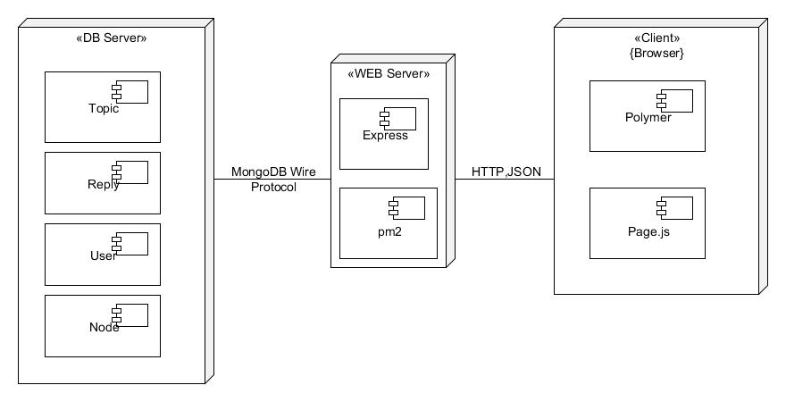

## 安装部署说明

部署图：



### 运行

1. 安装 Node.js 与 MongoDB，并做好相应的配置。推荐使用 nvm 管理 Node.js。
  * 参考：[nvm 与 Node.js 安装方法](https://github.com/creationix/nvm)
  * 参考：[MongoDB 安装方法](http://docs.mongodb.org/manual/installation/)
2. 安装依赖。运行

  ```bash
  npm install -g bower # 如果没有安装过 bower
  npm install
  bower install
  ```
3. 运行 MongoDB 并配置 db.js。默认数据库为 `mongodb://localhost:27017/getoffer`，可参考 db.js 内的注释进行配置。
4. 运行服务器，可直接运行：

  ```bash
  node bin/www
  ```
  或使用 pm2 守护：

  ```bash
  npm install -g pm2  # 如果没有安装过 pm2
  pm2 start bin/www
  ```
  默认使用 3000 端口，可用 nginx 反向代理 80 端口。

### 开发

1. 安装 supervisor，gulp

  ```bash
  npm install -g supervisor
  npm install -g gulp
  ```
2. 载入测试数据

  ```bash
  node fixture.js
  ```
3. 如需要开启前端开发环境（监视前端代码并在修改时重启，使用 livereload）：

  ```bash
  gulp serve
  ```

  模拟生产环境：

  ```bash
  gulp serve:dist
  ```
  访问 `http://localhost:3000`
4. 如需要开启后端开发环境（监视后端代码并在修改时重启）：

  ```
  npm start
  ```
  访问 `http://localhost:3000`

### 测试

运行测试：

```bash
npm test
```
